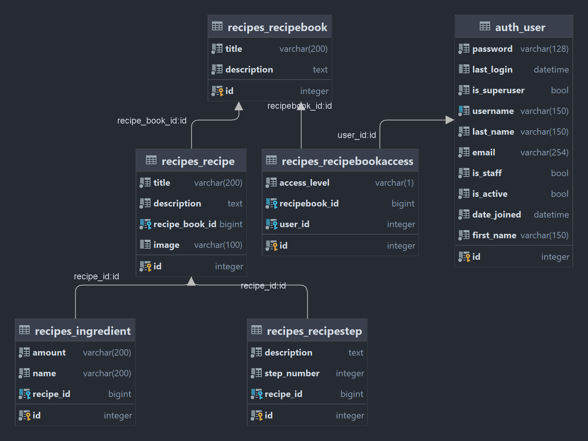

# YARA - Yet another recipe app

Demo: [https://reithmeir.duckdns.org:8888/](https://reithmeir.duckdns.org:8888/)

## Motivation

Meine Freundin und ich haben dass Problem dass wir öfters Rezepte auf Webseiten finden,
welche wir eigentlich gut finden. Diese aber das nächste mal wieder zu finden stellt sich als schwierig heraus.
Wir speichern sie aktuell in einer WhatsApp Gruppe, aber das ist nicht wirklich praktisch.  
Daher habe ich mich entschieden eine kleine Webapp zu schreiben, in welcher wir Rezepte speichern können.

## Features

Die ursprüngliche Version soll nur die wichtigsten Features haben, welche wir benötigen:

- Erstellen von Rezepten
- Importieren von Rezepten aus dem Internet
- Anzeigen von Rezepten
- Suchen von Rezepten
- Gruppieren von Rezepten in Rezeptbüchern
- Teilen von Rezeptbüchern mit anderen Nutzern

## Technologien

Für das Backend war die Vorgabe, dass es in Python geschrieben sein soll.  
Deshalb habe ich mich für Django entschieden, da ich davon schon viel Gutes gehört habe.  
Da ich aber ein reaktiveres Frontend haben wollte, und nicht nur Serverseitiges Rendering nutzen wollte, habe ich mich
für Django Rest Framework entschieden, welches eine REST API für Django bereitstellt.  
Für das Frontend habe ich mich für Angular entschieden, da ich schon erste Erfahrungen damit gemacht habe, und es mir
gut gefällt.  
Als Datenbank habe ich mich für Postgres entschieden, da ich den Server auf meinem Raspberry Pi laufen lassen möchte, und
es für Postgres einen Docker Container gibt, welcher auf dem ARM Prozessoren läuft.  
Als Deployment Umgebung habe ich mich für einen Docker Compose Stack entschieden, da ich so die einzelnen Komponenten
einfach hochfahren kann, und es die Abgabe des Projektes vereinfacht.

## Installation

- Erstellen der .env Datei aus der .env.sample Datei
- Anpassen der .env Datei
- Ausführen von `docker-compose up -d`

## Datenmodell

Für die Nutzerverwaltung wird das Django User Model verwendet.  
Das Superuser Model wird in allen Endpoints unterstützt, und erlaubt das Umgehen der Berechtigungen.

Das Datenmodell besteht aus den folgenden Models:


- recipebook:
    - title: Name des Rezeptbuchs
    - description: Kurze Beschreibung des Rezeptbuchs
- recipebookaccess: Verknüpfungstabelle zwischen Nutzern und Rezeptbüchern
    - access_level: "Read" oder "Full", gibt an ob der Nutzer nur lesen oder auch schreiben darf
    - recipebook_id: Fremdschlüssel auf das Rezeptbuch
    - user_id: Fremdschlüssel auf den Nutzer
- recipe:
    - title: Name des Rezepts
    - description: Kurze Beschreibung des Rezepts
    - recipebook_id: Fremdschlüssel auf das Rezeptbuch
    - image: Pfad zum Bild des Rezepts
- ingredient:
    - amount: Menge der Zutat
    - name: Name der Zutat
    - recipe_id: Fremdschlüssel auf das Rezept
- recipestep:
    - step_number: Nummer des Schritts
    - description: Beschreibung des Schritts
    - recipe_id: Fremdschlüssel auf das Rezept

Ingredient wurde in amount und name aufgeteilt, um es später zu ermöglich die Zutaten anhand der gewünschten Portionen
zu skalieren.  
Aktuell hat nur das Rezept ein Bild, obwohl es ursprünglich geplant war, dass auch das Rezeptbuch, die Ingredient und
die Schritte ein Bild haben, das hat aber zeitlich nicht mehr geklappt.

## Endpoints

### GET

- `users/current/`  
  Get the user object for the currently authenticated user  
  **returns:**

```
{
  "$schema": "http://json-schema.org/draft-04/schema#",
  "type": "object",
  "properties": {
    "username": {
      "type": "string"
    },
    "email": {
      "type": "string"
    },
    "groups": {
      "type": "array",
      "items": {}
    },
    "id": {
      "type": "integer"
    }
  }
}
``` 

- `users/`  
  Get a paginated list of all users, can be filtered by username    
  **accepts qp:** page:int, search:string  
  **returns:**

```
{
  "$schema": "http://json-schema.org/draft-04/schema#",
  "type": "object",
  "properties": {
    "count": {
      "type": "integer"
    },
    "next": {
      "type": "null"
    },
    "previous": {
      "type": "null"
    },
    "results": {
      "type": "array",
      "items": [
        {
          "type": "object",
          "properties": {
            "url": {
              "type": "string"
            },
            "username": {
              "type": "string"
            },
            "id": {
              "type": "integer"
            }
          }
        }
      ]
    }
  }
}
```

- `recipeBooks/`  
  Get all recipebooks for the current user, can be filter to get only recipebooks where the user has write access  
  **accepts qp:** write:boolean  
  **returns:** TODO
- `recipeBooks/:id/`  
  Return a single recipebook, contains more detail than list view, does not contain recipes  
  **returns:** TODO
- `recipes/:id/`  
  Return a single recipe, contains more detail than list view    
  **returns:** TODO
- `recipes/`  
  Get all recipes for the current user, can be filtered by recipebook and by a search string  
  **accepts qp:** recipe_book:int, search:string  
  **returns:** TODO

### POST

- `processUrl/`
  Process a URL to a website with a recipe, returns JSON with recipe data

  **accepts:** `{"url": "string"}`  
  **returns:**

```
{
  "$schema": "http://json-schema.org/draft-04/schema#",
  "type": "object",
  "properties": {
    "author": {
      "type": "string"
    },
    "canonical_url": {
      "type": "string"
    },
    "category": {
      "type": "string"
    },
    "cook_time": {
      "type": "number"
    },
    "description": {
      "type": "string"
    },
    "host": {
      "type": "string"
    },
    "image": {
      "type": "string"
    },
    "ingredients": {
      "type": "array",
      "items": [
        {
          "type": "object",
          "properties": {
            "name": {
              "type": "string"
            },
            "amount": {
              "type": "string"
            }
          },
          "required": [
            "name",
            "amount"
          ]
        }
      ]
    },
    "instructions": {
      "type": "string"
    },
    "instructions_list": {
      "type": "array",
      "items": [
        {
          "type": "string"
        }
      ]
    },
    "language": {
      "type": "string"
    },
    "nutrients": {
      "type": "object"
    },
    "prep_time": {
      "type": "number"
    },
    "ratings": {
      "type": "number"
    },
    "site_name": {
      "type": "string"
    },
    "title": {
      "type": "string"
    },
    "total_time": {
      "type": "number"
    },
    "yields": {
      "type": "string"
    }
  }
}
```

- `generateRecipeThumbnail/`  
  Create a Thumbnail for a recipe using AI  
  **accepts:** {"recipe_json": "..."}  
  **returns:** ["base64String",...]
- `login/`  
  **accepts:** {"username": "username", "password": "password"}  
  **returns:** {"token": "token"}
- `register/`
  **accepts:** {"username": "username", "password": "password"}  
  **returns:** {"token": "token"}

## Frontend

Für das Frontend wollte ich eine einfache und übersichtliche Oberfläche haben, welche sich auf die wichtigsten
Funktionen beschränkt.  
Dafür habe ich sehr an das Google Material 3 Design gehalten.
Jedoch wollte ich schon immer mal Tailwind CSS ausprobieren, und habe deswegen das Styling damit gemacht.

### Authentifizierung

Der Session Token welcher von Django Rest Framework verwendet wird, wird im LocalStorage gespeichert.
Dadurch ist es möglich, dass der Nutzer eingeloggt bleibt, auch wenn er die Seite schließt.
Der Token wird beim Login und beim Registrieren gesetzt, und beim Logout gelöscht.
Das Frontend nutzt folgende Komponenten für die Authentifizierung:

- `auth.service.ts`: Service welcher die Authentifizierung durchführt und token im LocalStorage speichert
- `auth.guard.ts`: Guard welcher bei Seitennavigation prüft ob ein Token vorhanden ist, und wenn nicht auf die Login
  Seite weiterleitet.
- `auth.interceptor.ts`: Interceptor welcher bei jeder HTTP Anfrage den Token im LocalStorage ausliest, und als
  Authorization Header hinzufügt. Außerdem wird bei einer 401 Antwort der Token gelöscht, und der Nutzer auf die Login
  Seite weitergeleitet.

### Error Handling

Das Frontend nutzt aktuell nur ein generisches Error Handling, welches bei jeder HTTP Anfrage prüft ob ein Django Error
zurückgegeben wurde, und diesen dann anzeigt.  
Hierfür werden folgende Komponenten verwendet:

- `error.interceptor.ts`: Interceptor welcher auf Status und Error Body prüft, und bei einem parsebaren Fehler diesen
  anzeigt.
- `notification.service.ts`: Service welcher Benachrichtigungen entgegennimmt, und diese anzeigt.
- `notification.component.ts`: Komponente welche oben rechts Benachrichtigungen als Toast anzeigt.

### Navigation Bar

Die App ist hauptsächlich für mobile Geräte gedacht, und hat deswegen eine Navigation bar am unteren Bildschirmrand.  
An dieser kann:

- Zur Startseite navigieren
- Sich ausloggen
- Ein neue Rezept erstellen
- Dummy Button

Damit Content nicht von der Navigation bar verdeckt wird, wird der Content um die Höhe der Navigation bar nach oben
verschoben und die Navigation bar hat einen verdeckenden Hintergrund welcher einen übergang zur Transparenz hat.

### Startseite

Auf der Startseite werden aktuell eine Liste aller Kochbücher angezeigt, auf welche der Nutzer Zugriff hat.  
Hier war eigentlich geplant, dass dem Nutzer rezepte vor geschlagen werden. Dies wurde aber noch nicht umgesetzt.

### Rezeptbuch

Die Rezeptbuch Seite zeigt alle Rezepte eines Rezeptbuchs an.  
Oben befindet sich eine Suchleiste, welche die Rezepte nach dem Titel filtert.
Rezepte haben eine Bildvorschau, den Titel und die Beschreibung.
Hat der Nutzer bearbeitungsrechte, kann er die Rezepte bearbeiten, und löschen.

### Rezept Erstellen

Die Rezepte erstellen Seite erlaubt es dem Nutzer ein neues Rezept zu erstellen oder zu importieren.
Oben kann der Nutzer eine URL zu einem Rezept eingeben, welches dann importiert wird und die anderen Felder automatisch
füllt.  
Alternativ kann der Nutzer auch ein Rezept manuell erstellen, und die Felder selbst ausfüllen.
Die Rezepte Schritte können per Drag and Drop sortiert werden.

### Rezept bearbeiten

Die Rezept bearbeiten Seite ist die gleiche wie die Rezept erstellen Seite, jedoch werden die Felder mit den Daten des
Rezepts gefüllt.

### Rezept anzeigen

Die Rezeptseite zeigt ein großes Bild des Rezepts. Darunter befindet sich die Beschreibung, die Zutaten und die
Schritte.

## Integration von OpenAI

Mit diesem Projekt wollte ich mal eine Anbindung an eine KI ausprobieren.  
Hierfür habe ich in zwei Endpoints eine Anbindung an die OpenAI API eingebaut.

Im Ordner promptTemplates befinden sich Texte welche an die AI Endpoints geschickt werden.

### Nachbearbeitung eines Importierten Rezepts

Für das importieren von Rezepten anhand einer Url nutze ich die Bibliothek `recipe-scrapers`.
Diese Bibliothek ist sehr gut, jedoch werden Zutaten nicht in "amount" und "name" aufgeteilt, sondern als ein einzelner
String.  
Diesen String zu trennen ginge zwar auch mit regulären Ausdrücken, jedoch gibt es da viele Edge Cases.
Deshalb wird der String an OpenAI geschickt, und die AI soll den String in "amount" und "name" aufteilen.

### Generieren von Rezeptthumnails

Ich wollte auch Bildgenerierung ausprobieren, und habe deswegen einen Button auf der Rezept erstellen / bearbeiten Seite
eingebaut, welcher ein Rezeptthumnail generiert.
Hierfür wird die aktuelle JSON Repräsentation des Rezepts an ein auf "gpt-3.5-turbo" basierendes Chat Model geschickt,
welches
die Aufgabe hat einen Prompt für ein Rezeptthumnail zu erstellen.
Dieser Prompt wird dann an ein auf "davinci" basierendes Bildgenerierungs Model geschickt, welches ein 1024x1024 Bild
generiert.  
Dieses wird dann dem Nutzer im Frontend angezeigt und er kann speichern oder neu generieren.

## Known Issues

Der Zustand der Anwendung ist aktuell noch eher der eines "MVP", und es gibt noch einige Probleme welche nicht
priorisiert wurden.

- **Frontend:** Authentication, ob Nutzer auf Seite zugreifen darf überprüft nur ob ein Token vorhanden ist, nicht ob
  dieser gültig ist.
- **Frontend:** Profil Button in Navigation Bar ist noch nicht implementiert.
- **Frontend:** Rezeptthumnail nimmt nicht volle Breite ein, wenn das Bild eine geringere Breite als der Container hat.
- **Frontend:** Generelles UI ist nicht sehr intuitiv/ Material Design wurde nicht strikt eingehalten.
- **Backend:** OpenAI Integration funktioniert nicht konsistent; das generierte JSON folgt nicht immer dem selben
  schema.
  Bald gibt es bessere Integration für JSON Antworten mit OpenAI Functions, aber aktuell kann ich es noch nicht nutzen
  und deshalb wurden ein paar Sonderfälle händisch abgefangen, jedoch kann es immer noch zu Fehlern kommen.
- **Backend:** Anfragen an Openai mit zu viel Text schlagen Fehl; hier müsste nur der wichtige Teil des Textes
  ausgewählt werden.


## Roadmap/TODOs
- **Backend:** Umsteigen auf GUIDs als IDs; aktuell werden die IDs als Integer gespeichert, was zu Problemen führen kann.
- **Backend:** Vereinheitlichen von Serializern; aktuell sind unterschiedliche Serializer Typen eingesetzt
- **Backend:** Entfernen von Django Template Code etc. Das Projekt wurde mit Django Templates gestartet, und dann auf
  Angular umgestellt. Es gibt noch einige Überreste von Django Templates, welche entfernt werden müssen.
- **Backend:** Implementieren von Tests; aktuell gibt es keine Endpoint Tests.
- **Backend:** Erstellen von Usagelimits für OpenAI Endpunkte. Aktuell kann jeder autheticated Nutzer die OpenAI
  Endpunkte nutzen, was zu hohen Kosten führen kann. (aktuell ist ein Kosten Limit von 1€/Monat eingestellt)
- **Backend:** Implementieren von CI/CD; aktuell wird das Projekt manuell deployed.
- **Backend:** Implementieren von OpenAPI; aktuell gibt nur die manuell erstellte API Dokumentation hier im README.md
- **Frontend:** Umsteigen auf Codegenerierung von OpenAPI; aktuell sind alle Models untyped, was eigentlich nicht ins

## Fazit

Insgesamt bin ich mit dem Ergebnis okay zufrieden.  
Mir persönlich gefätt Django als Backend Technologie nicht zu 100%, da ich die Typsicherheit von Java/C# gewohnt bin.  
Ich bin mir sicher, dass ich auch viele Dinge falsch gemacht habe, da ich bisherige Vorgehensweisen in Django verwenden
wollte, obwohl diese nicht in das Django System passen.  
Tailwind finde ich für styling sehr angenehm und werde ich glaube ich auch weiterhin verwenden, wenn es sich anbietet.  
Inwieweit es sich aber für größere Projekte eignet, kann ich noch nicht sagen.  
Beim nächsten Projekt werde ich auf jeden Fall mehr mit OpenAPI arbeiten und lieber von Beginn an Codegenerierung und
CI/CD bzw mich ans Deployment kümmern.  
Außerdem muss ich versuchen die Tests nicht zu vernachlässigen. Bei diesem Projekt ging es jetzt noch, da ich nur eine
Handvoll Endpunkte habe, aber bei größeren Projekten schleichen sich da bestimmt schnell Fehler ein.


